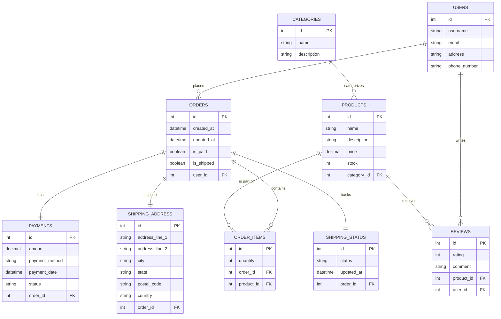

## Data modeling Building an e commerce data model Organize models in apps



## Create Django Apps

Navigate to your project directory in the terminal and run the following commands to create Django apps:

```python
python manage.py startapp users
python manage.py startapp products
python manage.py startapp orders
python manage.py startapp payments
python manage.py startapp shipping

```

## Register Apps

Add the newly created apps to your project's` INSTALLED_APPS` in `settings.py`:

```python
INSTALLED_APPS = [
    ...
    'users',
    'products',
    'orders',
    'payments',
    'shipping',
]

```

## Run Migrations

Run migrations to create database tables for your models:

```python
python manage.py makemigrations
python manage.py migrate

```

`This will create the necessary tables in your database based on the models you've defined.`
